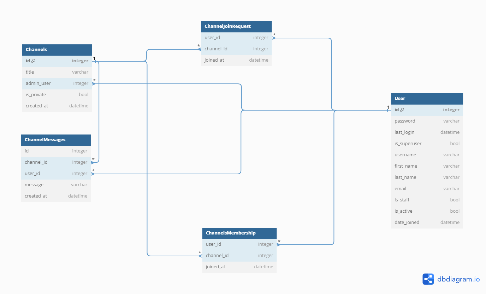

# [TR]

# Sohbet Uygulaması

Kullanıcıların kanal oluşturabildiği, mevcut kanallara katılabildiği, mesaj gönderebildiği ve kanal üyeliklerini yönetebildiği basit bir sohbet uygulamasıdır. Uygulama, istek yoluyla kanallara katılma, katılma isteklerini onaylama veya reddetme, kanallardan ayrılma, kanal yönetimi gibi özellikler sunmaktadır.
Not: Mesajlar gerçek zamanlı değildir.

## Özellikler

- Kullanıcı kimlik doğrulaması: Kullanıcılar kaydolabilir, oturum açabilir ve oturumu kapatabilir.
- Kanal yönetimi: Kullanıcılar yeni kanallar oluşturabilir ve mevcut kanalları düzenleyebilir (eğer kanal yöneticisi iseler).
- Katılma istekleri: Kullanıcılar özel kanallara katılma talebinde bulunabilir ve kanal yöneticileri bu istekleri onaylayabilir veya reddedebilir.
- Mesajlaşma: Kullanıcılar katıldıkları kanallarda mesaj gönderebilirler.
- Kanal üyeliği yönetimi: Kullanıcılar kanallardan ayrılabilir ve kanal yöneticileri kanal üyeliklerini yönetebilir.

## Kullanılan Teknolojiler

- Python/Django: Arka uç geliştirme
- HTML/CSS/JavaScript: Ön uç geliştirme
- SQLite3: Veritabanı yönetimi
- Bootstrap: Ön uç tasarımı

## Kurulum

1. Depoyu klonlayın:

     ```bash
    git clone https://github.com/username/MyProject.git
    ```

2. Sanal bir ortam oluşturun ve etkinleştirin:

      ```bash
    python -m venv env
    source env/bin/activate
    ```

3. Gerekli bağımlılıkları yükleyin:

      ```bash
    pip install -r requirements.txt
    ```

4. Migrate:

      ```bash
    python manage.py migrate
    ```

5. Sunucuyu başlatın:

     ```bash
    python manage.py runserver
    ```

6. Tarayıcınızda `http://127.0.0.1:8000` adresine gidin.

# [EN]

# Chat Application

This is a simple chat application where users can create channels, join existing channels, send messages, and manage channel memberships. The application provides features such as joining channels via request, approving or rejecting join requests, leaving channels, and channel administration. 
Note: Messages are not realtime.

## Features

- User authentication: Users can sign up, log in, and log out.
- Channel management: Users can create new channels and edit existing ones (if they are the channel admin).
- Join requests: Users can request to join private channels, and channel admins can approve or reject these requests.
- Messaging: Users can send messages in channels they have joined.
- Channel membership management: Users can leave channels, and channel admins can manage channel memberships.

## Technologies Used

- Python/Django: Backend development
- HTML/CSS/JavaScript: Frontend development
- SQLite3: Database management
- Bootstrap: Frontend design

## Installation

1. Clone the repository:

    ```bash
    git clone https://github.com/username/MyProject.git
    ```

2. Create and activate a virtual environment:

    ```bash
    python -m venv env
    source env/bin/activate
    ```

3. Install the required dependencies:

    ```bash
    pip install -r requirements.txt
    ```

4. Migrate the database:

    ```bash
    python manage.py migrate
    ```

5. Start the server:

    ```bash
    python manage.py runserver
    ```

6. Navigate to `http://127.0.0.1:8000` in your browser.

## Database Diagram

